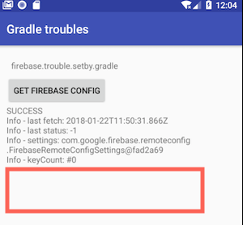
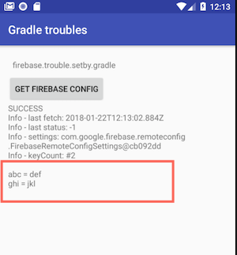

# Firebase config

Example project which shows an issue with Firebase read config and setup by code

# open issue:

We set Firebase config by code, and **not** by `google-services.json` 
When we read config, it's successful, but config files *are not included*

**This is our issue !**

# workaround

But when I remove comment from `app/build.config` line 97 and enable this line

`resValue "string", "google_app_id", "1:1093394223259:android:135c9bbacc945e22"` 

it works properly 

# expected behavior by Firebase

Only one time setting in code is done, and no more setting twice in build.gradle is necessary